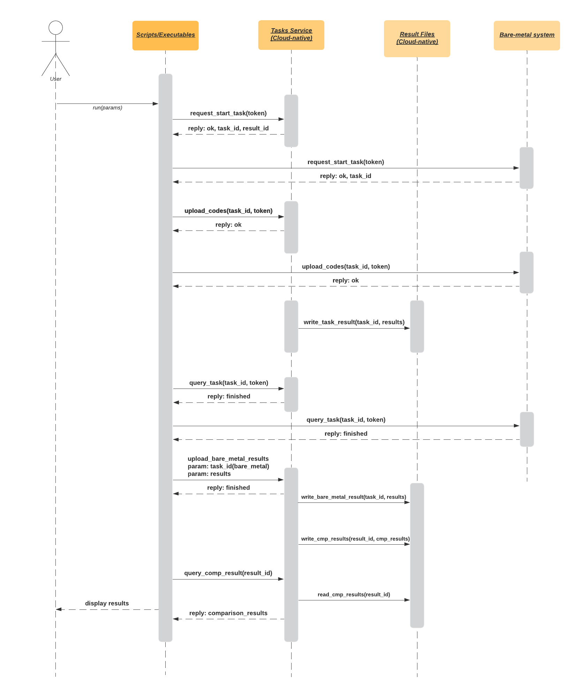

<h1 align="center"> Cloud Native Deployments of Bare-Metal AI Workflows  </h1> 
<h3 align="center"> Built in collaboration with MIT, MOC, Red Hat, and BU </h3> 

***

# Index

1. [BigGan Deep Learning](#biggan-deep-learning)
2. [Video Demonstration](#video-demonstration)
3. [HPC to Cloud Changes](https://github.com/BU-CLOUD-S20/Cloud-native-deployments-of-bare-metal-high-performance-AI-workflows/blob/master/README.md#summary-to-get-biggan-from-an-hpc-to-the-cloud)
3. [Deployment Instructions](#deployment-instructions)
4. [Project Proposal](#project-proposal)
5. [Sprint Presentations](#sprint-presentations)
6. [Project Report](https://github.com/BU-CLOUD-S20/Cloud-native-deployments-of-bare-metal-high-performance-AI-workflows/blob/master/REPORT.md)
7. [Team Info](#team-info)

# BigGAN Deep Learning
To understand the AI workflow (BigGAN) we will be porting from Satori into MOC's OpenShift, please visit this page [here](https://github.com/alexandonian/BigGAN-PyTorch). <br>

***

# Video Demonstration
Here we will roughly outline the project, challenges, as well as visualized deployment instructions. 
[Our YouTube video](https://www.youtube.com/watch?v=ar7XRZvGghE&feature=youtu.be).


***

# Summary to get BigGAN from an HPC to the Cloud
Here we will outline a general summary of changes we had to make in order to get our AI workflow, BigGAN, from MIT's Satori into the MOC (that is bootstrapping OpenShift). This can be extendable to many applications so that an application running in an HPC environment could be brought to a cloud native environment in a more facilitaed fashion. 

Because this is newfound territory and is cutting-edge at the moment, users attempting such a transition might find themselves with other, unmentioned difficulties, but these will serve as a general guide/solution.

### 1. Base Image Update
> **Note:** we are building our base image on top of IBM's `PowerAI` base image using interactive mode. This can be done on any POWER9 machine that is running docker.

- If you do not have a volume mounted on OpenShift, you will have to copy data into the container:
   - In our case, we copied a subset of the Imagenet data `tmpdata` in our base image (that we pull from dockerhub [here](https://hub.docker.com/layers/atlas4openshift/powerai/tmpdata/images/sha256-2d2c4fe91a53e353e9ba41d8506d6bebbde8bcfc2c6d299ade9b85f09c10a174?context=explore)).
- If you do have sufficient volume mounted, then you can specify the additional packages your environment will need:
   - In our case we needed `git` to clone our GitHub repo (and BigGAN), `sar` to monitor system processes, and `sysbench` to further monitor performance of our workflow.

### 2. Dockerfile
The [Dockerfile](workflows/BigGAN/gpu/openshift/Dockerfile
) is for OpenShift's `BuildConfig` to build new images from our base image. We provided this Dockerfile for the following reasons:
1. Once users push new codes to their GitHub repositories, they can simply trigger `BuildConfig` to build new images with new codes updates.
2. Since OpenShift uses a default user id while running a container from the image we built, and that user ID **DOES NOT** have a matched user name -- the Anaconda environment cannot work since to initialize and activate the Anaconda envrionment, there needs to be a user name. We used some 'hack' code (provided by OpenShift) in [entrypoint.sh](workflows/BigGAN/gpu/openshift/scripts/entrypoint.sh) to assign a user name to this default user ID. We do not want to hardcode it inside the image since this user ID may change in the future, even though currently OpenShift gives this ID with a fixed value.
3. Clone our workflow code from the GitHub repository in our Dockerfile -- we do not want to hardcode it since code may change frequently in the future.
4. Set up the work directory since the default work directory is `/` (system root directory).

### 3. Convert LSF Jobs to bash scripts on OpenShift
Here we will be discussing how to convert LSF jobs from Satori into similiar commands on the OpenShift platform.

This is a short snippet of how one of these jobs looks like (in this example we used the`biggan128_imagenet.lsf` found [here](https://github.com/BU-CLOUD-S20/Cloud-native-deployments-of-bare-metal-high-performance-AI-workflows/blob/master/workflows/BigGAN/gpu/satori/scripts/biggan128_imagenet.lsf)).
```
#BSUB -L /bin/bash
#BSUB -J "BigGAN128-ImageNet"
#BSUB -o "BigGAN128-ImageNet.%J"
#BSUB -e "BigGAN128-ImageNet.%J.err"
#BSUB -n 4
#BSUB -R "span[ptile=1]"
#BSUB -gpu "num=2"
#BSUB -q "normal"

# Setup User Environement (Python, WMLCE virtual environment etc)
HOME2=/nobackup/users/$(whoami)
PYTHON_VIRTUAL_ENVIRONMENT=wmlce-1.6.2
CONDA_ROOT=$HOME2/anaconda3

DATA_ROOT=data
DATASET=ImageNet
RESOLUTION=128
```

Since LSF jobs are the bash scripts for running AI workflows on Satori, but some codes are optimized for Satori. Therefore, to run the AI workflow on OpenShift, we need to modify these LSF jobs to bash scripts, here are things we did:
1. `mpirun` currently cannot work on OpenShift, we simply remove this command
2. Disable distributed mode for BigGAN since for this short term project, we are not able to make it run in distributed mode on OpenShift.
3. Change the environment variables to match the environment on the images built by OpenShift.


### 4. OpenShift Environment Variables
To enable NVIDIA CUDA devices available in the OpenShift container, we need to set up the following environment variables while running the container:
```
env:
   - name: NVIDIA_VISIBLE_DEVICES
      value: all
   - name: NVIDIA_DRIVER_CAPABILITIES
      value: "compute,utility"
   - name: NVIDIA_REQUIRE_CUDA
      value: "cuda>=5.0"
```

> **Note**: we put this in the `Pod YAML file` or `DeploymentConfig`.

***

# Deployment Instructions

### Clone the project
```
git clone https://github.com/BU-CLOUD-S20/Cloud-native-deployments-of-bare-metal-high-performance-AI-workflows.git
cd Cloud-native-deployments-of-bare-metal-high-performance-AI-workflows
```


## MIT Satori

- Satori is a GPU dense, high-performance Power 9 system developed as a collaboration between MIT and IBM. It has 64 1TB memory Power 9 nodes. Each node hosts four NVidia V100 32GB memory GPU cards. Within a node GPUs are linked by an NVLink2 network thst supports nearly to 200GB/s bi-directional transfer between GPUs. A 100Gb/s Infiniband network with microsecond user space latency connects the cluster nodes together.

#### To deploy on Satori do the following:

1. Get access to Satori following instructions in the [Satori Documentation](https://mit-satori.github.io/satori-basics.html)
2. Point your browse to the [Satori Open On-Demand (OOD)  portal](https://satori-portal.mit.edu/pun/sys/dashboard)
3. Set up and activate the [IBM Watson Machine Learning Community Edition (WMLCE)](https://mit-satori.github.io/satori-ai-frameworks.html#) conda environment.
4. On the top menu bar got to **Clusters -> Satori Shell Access**.
5. In the  shell get the test repo by typing  **git clone <https://github.com/alexandonian/BigGAN-PyTorch.git>**. Please read the README of that repo for an in-depth explanation of the steps we will complete.
6. Once the repo has been cloned, check out the `satori` branch with: \
`git checkout -b satori --track origin/satori`
7. Next, run the setup script with: \
`sh setup.sh` \
to prepare some data directories and symlinks. Currently, ImageNet is the only shared dataset stored on Satori under `/data/ImageNet`; however, more may be added in the future.
8. (Optional): To prepare your dataset as a single HDF5 file, please run \
`bsub < jobs/make_hdf5.lsf` \
with the appropriate parameters.
9. In order to measure sample quality during training, you will need to precompute inception moments for the datset of interest. To do this, run the corresponding lsf script with: \
`bsub < jobs/calculate_inception_moments.lsf`
10. Now we are ready to submit our first training job, which can be done with any of the `jobs/biggan*` lsf scripts. 
We use this file **[here](https://github.com/BU-CLOUD-S20/Cloud-native-deployments-of-bare-metal-high-performance-AI-workflows/blob/update-readme/ReadMe-image/modified%20job)**.
11. During training, it's useful to monititor various training metrics, which can be done via a Jupyter Notebook. Go back to the OOD Dashboad window (labeld **My Interactive Sessions**) and go to menu option **Interactive Apps -> Jupyter Notebook**.
12. Click the **Connect to Jupyter** button when it appears in a few moments
13. When Jupyter comes up for the first time, you may be prompted to select a kernel, If so, choose the default **Python 3 PowerAI**
14. Use the left navigation pane to find the git repo directory (**BigGAN-PyTorch**) you downloaded in step 4. Click into `BigGAN-PyTorch/notebooks` and double click on the Jupyter notebook **Monitor.ipynb**.


## MOC OpenShift


- The goal of The Massachusetts Open Cloud (MOC) OpenShift Service is to deploy and run the OpenShift container service in a production like environment to provide users of the MOC a container service for their projects. They are currently running two environments. The main service is high availability (HA) configured with multi-tenant option. The secondary service is more of a staging area that is currently being used to test configuration of GPU-enabled nodes.

1. Get access to MOC OpenShift [Here](https://p9-openshift.osh.massopen.cloud:8443)
2. Build new images with [BuildConfig](https://github.com/BU-CLOUD-S20/Cloud-native-deployments-of-bare-metal-high-performance-AI-workflows/blob/master/workflows/BigGAN/gpu/openshift/configs/buildconfig-gpubiggan.yaml) we provided.
   - Remember to modify the name of `BuildConfig` and the output image repository name.
   - Change the `Dockerfile` source if needed. In our case, we use Github source, and the `Dockerfile` is inside our Github repository. Don't forget changing the branch of repository.
3. Deploy an image
   - `Option 1`: Auto-deploy, reuseable: import [DeploymentConfig](https://github.com/BU-CLOUD-S20/Cloud-native-deployments-of-bare-metal-high-performance-AI-workflows/blob/master/workflows/BigGAN/gpu/openshift/configs/deployconfig-gpubiggan.yaml) to the OpenShift
   - `Option 2`: Disposable, specific pod: import [Pod YAML file](https://github.com/BU-CLOUD-S20/Cloud-native-deployments-of-bare-metal-high-performance-AI-workflows/blob/master/workflows/BigGAN/gpu/openshift/configs/pod-biggan.yaml) to the OpenShift
  
> #### How to import `BuildConfig`, `DeploymentConfig` or `Pod YAML file`

1. Click `Add to Project` button


2. Click `Import YAML/JSON` button and copy YAML file content into this window.


3. Click `Create`

Remember to change the `DeploymentConfig` name or pod name, and the image you are going to use, you can also set up triggers for `DeploymentConfig`.

***

# Project Proposal

## 1.   Vision and Goals Of The Project:

Our project will serve as a bridge from existing bare-metal HPC clusters (example: Satori@MIT) to a native cloud environment for better resource utilization and price-efficiency. High-level goals include:
- Survey existing MIT bare-metal workloads and containerize one of them.
- Monitor and compare OpenShift workflows and bare-metal workflows.
- Generate a report that portrays the pros/cons of migrating bare-metal workflow to OpenShift environment.

## 2. Users/Personas Of The Project:

**This system will target the following users:**

- AI researchers looking to deploy **high-performance** AI workflows that are currently in a bare-metal environment, to a cloud native environment. 
- Machine learning/AI engineers looking to deploy an extant, ‘power/processing-hungry’ system to a cloud environment.
- Users seeking more privacy around their data that is transmitted to the cloud (provided by OpenShift).
- Users looking to utilize tools such as [Singularity](https://www.sylabs.io/docs/), or other virtualization systems to containerize workflows in the HPC (high-performance computing) clusters.
- A quintessential example of a user could be the MIT-IBM Watson AI laboratory looking to scale their workflows into the cloud in a discrete fashion. 
- Average users/hobbyists looking to deploy non-intensive computational processes to the cloud.


**This system will NOT target the following users:**

- Users with complex requirements who might require additional interface/systemic modification.

## 3.   Scope and Features Of The Project:
- Create any documentation and scripts that allow users to containerize existing High Performance (AI) workflows
- Generate charting that compares performance metrics (potentially with regard to: elasticity, economics, performance, data access and scalability) between bare-metal and OpenShift environments.
- Generate display (of suggestions) for ‘under-utilized’ nodes in OpenShift that could be used for running backfill workloads.
- Ability to deploy researcher workflows or code with ease from a bare metal environment to OpenShift/Kubernetes

## 4. Solution Concept
### Global Architectural Structure Of the Project:
Below is a description of the system components that are building blocks of the architectural design:
- **Scripts/Executables:** Users can write the scripts/executables to specify the commands for OpenShift and Satori.
- **Containers:** The containers include the codes of AI program. And deployed by OpenShift
- **Volumes:** Used for save training/test/validation data of AI program as well as results of the program.

> `Figure 1` below shows the overview architecture of this project.


<p align="center">Figure 1: Global Architectural Structure Of the Project</p>

<!-- 
<p align="center">Figure 2: Sequence diagram of this project</p> -->

### Design Implications and Discussion:
This section discusses the implications and reasons for the design decisions made during the global architecture design.
- **Scripts/Executables:**
In order to compare two systems benefits, the Scripts/Executables will be needed to easily upload the codes to the bare-metal system and cloud-native (OpenShift) at the same time. And the scripts/executables will be one of the most important parts of the whole workflow since it will tell how OpenShift and Satori do to make the AI workflow work, and get the returned comparison results to the users.
- **Containers:** On OpenShift, we should use **BuildConfig** to automatically build images for AI workflows and deploy them via **DeploymentConfig** as containers. **DeploymentConfig** can be triggered to deploy a new container if **BuildConfig** is triggered. Each container can only serve for one application.
- **Volumes:** For persistent storage, save data in containers or downloading data from internet every single time is not a wise choice, so we decide to use volume on OpenShift to store our data.

## 5. Acceptance criteria
The minimum acceptance criteria is an interface that is able to containerize and deploy a specific AI workflow, many of which are currently existing in the MIT HPC. The system must also be able to generate comparison metrics (on a few dimensions such as elasticity, performance, economics, etc.) between the project being run in a native cloud environment (in our case; the ‘hybrid cloud’ system, OpenShift) and a bare metal environment. Some stretch goals we hope to implement are:
- Directing resources to under-utlized nodes (or minimally displaying that there are such instances) in an effortless manner.
- Extending to a wider class of projects by circumventing the problem of workflows being tied to a current system.


## 6.  Release Planning:
`Release 1 (Week 5):` 
- Try to deploy at least one specific workflow to OpenShift
- Be able to spawn a bare metal and cloud job for a particular workflow

`Release 2 (Week 9):` 
- Write scripts that monitors both the bare-metal and cloud workflow and displays one dimension of performance in real-time
- Some preliminary form of an interface to communicate with our system 

`Release 3 (Week 13):` 
- Design a platform that, in tandem, can start both the bare metal and cloud job using https/ssh protocol.
- Interface to include detailed comparison between bare-metal env. & cloud-native implementations of parallel ML workflows.
- Display under-utilized nodes in OpenShift and perhaps suggestions/actual effectuations of running backfill overloads.

***

# Sprint Presentations

You find them [Here](https://github.com/BU-CLOUD-S20/Cloud-native-deployments-of-bare-metal-high-performance-AI-workflows/blob/master/doc/Sprint-Presentations-inde.mdx)


## Optional Features
- Automatic deploy experiments: Because tasks need to be deployed automatically, so there should have an interface or containers to automatically execute the experimental codes in two different environments.
- Generalized: orientation is mostly towards high-performance AI workflows, but should have the capability to deploy a wide range of projects. 
- Use of a 'Hybrid Cloud’ environment that will allow data to be processed either at local workstations with some nodes from AWS/GSP, or at OpenShift’s own centers (a medley of on-site, private cloud and third-party).
- Ability to operate with ease across multiple deployments (MIT HPC, MIT-IBM Watson lab, etc.).
- A easy-to-operate interface with the following features/functions:
  - Simple management of the users of the system.
  - Ability to add/deploy a wide-variety extant projects with ease.
  - Manipulation (with relatively low latency) of low-level resources such as: computing, network, storage, node allocation.
  - Simple to view instances and launch/suspend new or existing instances.
  - View existing networks.
- Ability to be scalable (a large number of users, services, projects, data) with workflows easily containerized in a timely fashion:
  - Streamlining scaling up through the following methods will also be explored:
    - Minimizing data inertia.
    - Circumventing workflow tied to a current system.
- Generalized: orientation is mostly towards high-performance AI workflows, but should have the capability to deploy a wide range of projects. 
- Generalize from supporting a specific workflow to supporting a wide range of bare-metal AI workflows that uses different machine learning frameworks.
