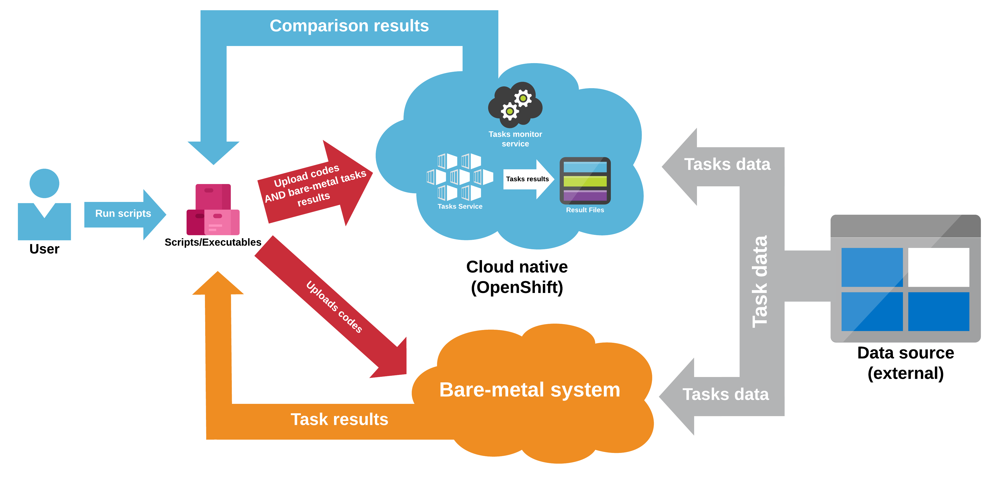

** **

# Atlas 
## Cloud Native Deployments of Bare-Metal High-Performance AI Workflows Proposal

## 1.   Vision and Goals Of The Project:

Atlas will serve as a bridge from existing bare-metal HPC clusters (example: Satori@MIT) to a native cloud environment for better resource utilization and price-efficiency. High-level goals of Atlas includes:
- Survey existing MIT bare-metal workloads and containerize one of them.
- Monitor and compare OpenShift workflows and bare-metal workflows.
- Generate a report that portrays the pros/cons of migrating bare-metal workflow to OpenShift environment.

## 2. Users/Personas Of The Project:

**This system will target the following users:**

- AI researchers looking to deploy **high-performance** AI workflows that are currently in a bare-metal environment, to a cloud native environment. 
- Machine learning/AI engineers looking to deploy an extant, ‘power/processing-hungry’ system to a cloud environment.
- Users seeking more privacy around their data that is transmitted to the cloud (provided by OpenShift).
- Users looking to utilize tools such as [Singularity](https://www.sylabs.io/docs/), or other virtualization systems to containerize workflows in the HPC (high-performance computing) clusters.
- A quintessential example of a user could be the MIT-IBM Watson AI laboratory looking to scale their workflows into the cloud in a discrete fashion. 
- Average users/hobbyists looking to deploy non-intensive computational processes to the cloud.

**This system will NOT target the following users:**

- Users with complex requirements who might require additional interface/systemic modification.

## 3.   Scope and Features Of The Project:
- Create any documentation and scripts that allow users to containerize existing High Performance (AI) workflows
- Generate charting that compares performance metrics (potentially with regard to: elasticity, economics, performance, data access and scalability) between bare-metal and OpenShift environments.
- Generate display (of suggestions) for ‘under-utilized’ nodes in OpenShift that could be used for running backfill workloads.
- Ability to deploy researcher workflows or code with ease from a bare metal environment to OpenShift/Kubernetes

## 4. Solution Concept
### Global Architectural Structure Of the Project:
Below is a description of the system components that are building blocks of the architectural design:
- **Scripts/Executables:** Users can write the scripts/executables to upload their codes and metadata of their program.
- **Tasks Services:** Tasks Services will run in containers; once a user finishes uploading code and metadata, the tasks monitor service will be triggered to generate a task service in a container.
- **Tasks monitor service:** This service should also run in a container, and monitor the execution status of a task, once a task finishes or fails, this service should report it. And it should also monitor all the key phases of a task, such as data preprocessing, data training, data prediction and so on, it can obtain the information from the metadata of this task which is uploaded with codes. After tasks finishing, this service should gather all the task results and organize them to form a comparison result between the cloud-native and bare-metal system.
- **Data source:** The training data, validation data, test data and any other chunk data with relation to the task should be stored outside the system, they can be on AWS or individual machines.

> `Figure 1` and `Figure 2` below show the overview architecture of this project and the rough sequence among each component.

`Figure 1:` Global Architectural Structure Of the Project

`Figure 2:` Sequence diagram of this project

### Design Implications and Discussion:
This section discusses the implications and reasons for the design decisions made during the global architecture design.
- **Scripts/Executables:**
In order to compare two systems benefits, the Scripts/Executables will be needed to easily upload the codes to the bare-metal system and cloud-native (OpenShift) at the same time. And the scripts/executables will be one of the most important parts of the whole workflow since it not only sends the codes but also sends results from the bare-metal system to the OpenShift database to let task monitor service compare and then return the comparison results to the users.
- **Task monitor service:** 
Since the tasks need uncertain time to complete, and may fail at any time, task monitor service will be needed to keep track of the detailed status of tasks, to see if each step finishes or fails (data preprocessing, data training, data prediction and so on), then after all tasks finishing, it will gather all the results to form the final deliverables.
- **Outside data import interface:**
Besides the data directly from users, systems will be able to retrieve the data from an external resource and able to do data screening. Because normally, the size of those data is very large, typically in gigabytes. 

## 5. Acceptance criteria
The minimum acceptance criteria is an interface that is able to containerize and deploy a specific AI workflow, many of which are currently existing in the MIT HPC. The system must also be able to generate comparison metrics (on a few dimensions such as elasticity, performance, economics, etc.) between the project being run in a native cloud environment (in our case; the ‘hybrid cloud’ system, OpenShift) and a bare metal environment. Some stretch goals we hope to implement are:
- Directing resources to under-utlized nodes (or minimally displaying that there are such instances) in an effortless manner.
- Extending to a wider class of projects by circumventing the problem of workflows being tied to a current system.

## 6.  Release Planning:
`Release 1 (Week 5):` 
- Try to deploy at least one specific workflow to OpenShift
- Be able to spawn a bare metal and cloud job for a particular workflow

`Release 2 (Week 9):` 
- Write scripts that monitors both the bare-metal and cloud workflow and displays one dimension of performance in real-time
- Some preliminary form of an interface to communicate with our system 

`Release 3 (Week 13):` 
- Design a platform that, in tandem, can start both the bare metal and cloud job using https/ssh protocol.
- Interface to include detailed comparison between bare-metal env. & cloud-native implementations of parallel ML workflows.
- Display under-utilized nodes in OpenShift and perhaps suggestions/actual effectuations of running backfill overloads.

## Optional Features
- Automatic deploy experiments: Because tasks need to be deployed automatically, so there should have an interface or containers to automatically execute the experimental codes in two different environments.
- Generalized: orientation is mostly towards high-performance AI workflows, but should have the capability to deploy a wide range of projects. 
- Use of a 'Hybrid Cloud’ environment that will allow data to be processed either at local workstations with some nodes from AWS/GSP, or at OpenShift’s own centers (a medley of on-site, private cloud and third-party).
- Ability to operate with ease across multiple deployments (MIT HPC, MIT-IBM Watson lab, etc.).
- A easy-to-operate interface with the following features/functions:
  - Simple management of the users of the system.
  - Ability to add/deploy a wide-variety extant projects with ease.
  - Manipulation (with relatively low latency) of low-level resources such as: computing, network, storage, node allocation.
  - Simple to view instances and launch/suspend new or existing instances.
  - View existing networks.
- Ability to be scalable (a large number of users, services, projects, data) with workflows easily containerized in a timely fashion:
  - Streamlining scaling up through the following methods will also be explored:
    - Minimizing data inertia.
    - Circumventing workflow tied to a current system.
- Generalized: orientation is mostly towards high-performance AI workflows, but should have the capability to deploy a wide range of projects. 
- Generalize from supporting a specific workflow to supporting a wide range of bare-metal AI workflows that uses different machine learning frameworks.

