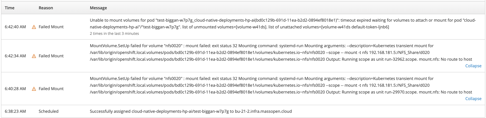
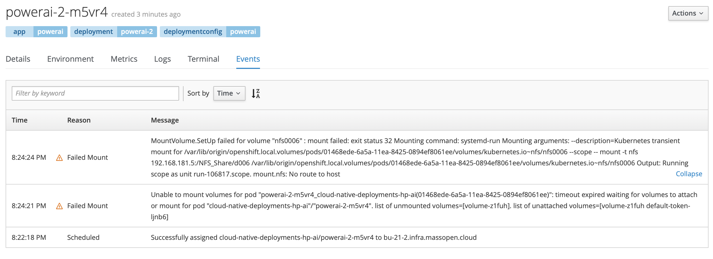
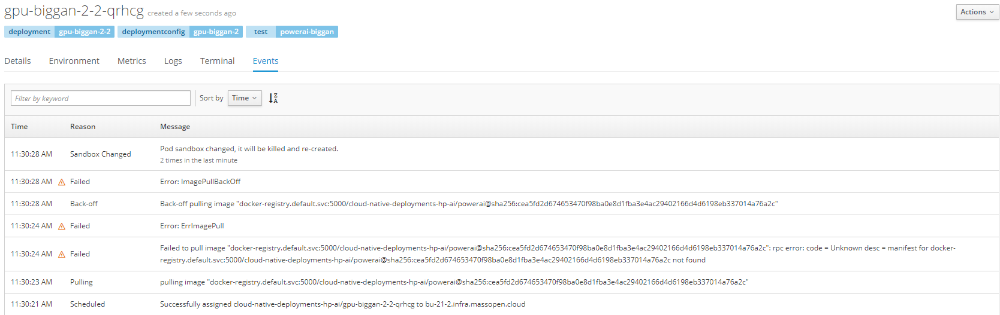

<h2 align="center"> Bare Metal High Performance AI Final Report </h2>

In this project, we take an AI workfow - [BigGAN](https://github.com/BU-CLOUD-S20/Cloud-native-deployments-of-bare-metal-high-performance-AI-workflows/blob/update-readme/README.md#mit-satori) in our case - that is operational in MIT's HPC [Satori](https://mit-satori.github.io/) (modded with IBM Power PC CPUs, NVIDIA V100 GPUs, etc.) and convert it to a running workflow on OpenShift ([Mass Open Cloud](https://massopen.cloud/)) to measure similarities and to delineate the process of moving an application from a bare metal environment to a cloud native platform.

The instructions to run BigGAN on Satori are [here](https://github.com/BU-CLOUD-S20/Cloud-native-deployments-of-bare-metal-high-performance-AI-workflows/blob/update-readme/README.md#mit-satori). These instructions are our starting point.


### Video Demonstration
Here we will roughly outline the project, challenges, as well as visualized deployment instructions. 
[Our YouTube video](https://www.youtube.com/watch?v=ar7XRZvGghE&feature=youtu.be).


***
# Index
1. [Conclusions](#Conclusions)
2. [Running On Satori](#Running-on-Satori)
3. [Running on Mass Open Cloud](#Running-on-OpenShift-on-MOC)
***
### Environment Specs 

|                  | MIT Satori    | MOC  |
| :-------------:  |:-------------:| -----:|
| GPU Architecture | TESLA V100 32GB | TESLA V100 32GB |
| CPU Architecture | IBM Power9      |   IBM Power9 |

Satori and Mass Open Cloud (MOC)*: 
- 64 1TB memory IBM Power 9 nodes
- Each node hosts 4 NVidia V100 32GB memory GPU cards
- Within a node, GPUs are linked by an NVLink2 network that supports nearly to 200GB/s bi-directional transfer between GPUs
- A 100Gb/s Infiniband network with microsecond user space latency connects the cluster nodes togehter

 ```*MOC has 2 cluster available, P-Openshift houses IBM Power 9 nodes and K-Openshift hosts x86 nodes. We work with P-Openshift in this experiment, as these are the same nodes inside the Satori cluster.```
 
***

# 1. Conclusions

<!-- ### 1. Efficiency 
`Measured as the ratio of useful output to total input (measured in CPU/GPU cycles here)` 
- Text for efficiency here...
  - more text here... -->

<!-- ### 2. Scalability 
`The ability of the cloud platform to function well when it's changed in size or volume in order to meet a user need (i.e. to rescale).`  -->

## 1. Elasticity

We selected the BigGAN workflow from a pool of [tutorial examples](https://mit-satori.github.io/tutorial-examples/index.html) offered on the Satori platform.  

We looked into each of the existing examples(workflows) and observed that they all used popular python-written machine learning library such as Tensorflow, PyTorch and Sklearn.  

We further investigate whether these software frameworks allow dynamic resource utilization. In other words, we want to know if these libraries allow the programs to scale-up  resource utilization when the instance(s) it's running in was(were) allocated with more computing resources.

Since the BigGAN workflow is written in PyTorch, we wil focus on discussing the possibility of running/training Pytorch programs in an "elastic manner":

### 1.1 Elasticity for PyTorch
According to Pytorch documentation [link here](https://pytorch.org/blog/pytorch-adds-new-tools-and-libraries-welcomes-preferred-networks-to-its-community/#tools-for-elastic-training-and-large-scale-computer-vision),  current PyTorch parallelism is achieved by something called **Distributed Data Parallel (DPP)** module, and it has following short-commings:  

1. Parallel jobs cannot start without aquiring all the request nodes(pod/containers).
2. Parallel jobs is not recoverable from node(pod/container) failures.
3. Parallel jobs is not able to incorporate nodes that join later.

Recently the comunity is working on incorporating **elastic training** functionality to PyTorch. Experimental implementation of the functionality can be found at [PyTorch-Elastic](https://github.com/pytorch/elastic).  

However, **PyTorch-Elastic** only supports AWS environment with Amazon Sagemaker and Elastic Kubernetes Service(EKS) and haven't support OpenShift yet.  

After discussion among group members, we figure that given the time and scope of our project, we might not be able to finish adapting **PyTorch-Elastic** to OpenShift environment and re-writing the BigGAN workflow using PyTorch-Elastic APIs by the end of the semester. We will leave it as a future TODO for now.
<!-- <h5 align="center"> shawn </h5> -->


## 2. Automation 
Compared with Satori, OpenShift does have more advantages on task automation which makes our lives much easier. To make our AI workflow be deployed automatically, we can follow these steps:
 1. Build new images from the base image we provided on `DockerHub` by using `BuildConfig`. After creating a `BuildConfig`, we can simply trigger this `BuildConfig` to start building new images. `BuildConfig` will first start a temporary container for a build, and retrieve the `Dockerfile` from the source we specified inside the `BuildConfig`, in our case, it will clone the Github repository we specified into this build container and get the `Dockerfile` inside the repository. Then `BuildConfig` will run `docker build` on this `Dockerfile` to build the new image, after finishing the build, it will push the new image to the Docker registry we specified, in our case, we simply chose to push new images to the MOC OpenShift docker registry. In addition, we can also set up triggers for `BuildConfig` which can let `BuildConfig` be triggered by Github Webhook, i.e. after we pushing our codes to Github repositories, it will trigger the `BuildConfig` **automatically** by the Webhook and we don't even need to do anything but pushing codes.
 2. After finishing building new images, we can deploy our new images by using `DeploymentConfig` (i.e. start a new container based on the images we built), unlike using `pod` YAML files, `DeploymentConfig` can keep creating pods if the containers are completed so that we do not need to describe pods over and over again. We can specify the image source, CPU, and GPU resources we need, environment variables, and so on inside `DeploymentConfig`. Similar to `BuildConfig`, `DeploymentConfig` can also be triggered by hand or image changes, i.e. after a new build finished by a `BuildConfig`, it will trigger `DeploymentConfig`to deploy the image and run the conatiner **automatically**.
 
Now, we can see that by deploying AI workflows on OpenShift, the only thing for researchers need to do is just push the new codes, and the AI workflows can be deployed **automatically** and get the result, without requesting node resources or submitting bash jobs.


## 3. Environment Comparisons
 


### 3.1 Components

A typical AI workflow has deals with a lot state. The computation steps are resource intensive and long running. The model training step can run for a few days on the training datasets of size ~200 GB even on powerful hardware such as the Telsa V100 GPUs. The output model is contantly iterated upon during at the end of training loops, and the state is checkpointed typically at the end of every epoch.

### 3.2 Scheduling

In a traditional HPC system like Satori, to run a job, you submit a  request for specific amount of resources, e.g. 4 GPUs and 2 CPUs. The scheduler waits for the resources to free, and then assigns the job.

In a Kubernetes based environment, you make request to the scheduler, and the scheduler tries its best to provide you with the request resouces. However, it is not guaranteed that the resources alloted to you will not change during the lifecycle of the computation.


### 3.3 Software Style

One consequence of the type of resource allocation, the actual program needs to be resilient to changes in resources available to programs. Software written to be cloud native have evolved to be resilient to failures. Cloud native software generally is built with decoupled state and computation. 

Our experience with the current AI workflows is that the programs are written assuming fixed resources. There is ongoing work in major frameworks to make them elastic. However, these are not yet in active use. Software running on top of Kubernetes runs in containers. Containers are standard units of software execution. They package up all the code and dependencies, easing portability. Program State or storage is an extension to this container model. By default, all writes inside a container are lost when the container no longer exists. To persist the writes, you either mount a volume, or do writes to a stable storage outside your container. e.g. write to Amazon S3.

To move an existing AI workflow to the cloud, you have to ensure that you have access to sufficient external storage that you can store your model and data to as external volume.


### 3.4 Environment Issues
<!-- <h2 align="center"> Environment Issues </h2> -->
<!-- <h5 align="center"> shawn + jing </h5> -->

- Trouble accessing GPU(s) on MoC
  * **Solution**: Specify CUDA related environment variables below in `DeploymentConfig` or `Pod YAML file`. (worked until Sprint 4)
  ```
  env:
        - name: NVIDIA_VISIBLE_DEVICES
          value: all
        - name: NVIDIA_DRIVER_CAPABILITIES
          value: "compute,utility"
        - name: NVIDIA_REQUIRE_CUDA
          value: "cuda>=5.0"
  ```
- Nvidia cards randomly unavailable
  * **Description**: Sometimes even if we specified the CUDA related environment variables, we still cannot get the CUDA devices in OpenShift container, it might due to someone else ran out of the GPU resources or some unknown environment issues.
  * **Solution**: None.
  * **Workaround**: Try more times. (worked until Sprint 4)
- Cannot get enough quota for volume
  * **Description**: We can only create 10GB RWO volume at first.
  * **Solution**: MoC administrator granted volume to our OpenShift account.
- Pod creation `timeout` or `no route to host` when mounting volume
  * **Description**: While creating a pod with volume mounted, it can show the two kinds of errors below:
    - 
    - 
  * **Solution**: Currently still blocked. Requires support from MoC.
  * **Workaround**: Manually copied subset of data and build into our base image to make the workflow runnable.
- Trouble pushing to internal image registry on OpenShift
  * **Description**: OpenShift reports error when pulling/pushing image to internel image registry. Possibly due to DNS mapping error on MoC. Currently we can not run any pods that uses our image on OpenShift.
  * **Solution**: Currently still blocked. Requires support from MoC.
  * **Workaround**: None.
- Pulling image error
  * **Description**: While deploying image, it will give the errors below, and the `Pod YAML file` or the `DeploymentConfig` we used are the same as before (they worked before)
    - 
  * **Solution**: Currently still blocked. Requires support from MoC.
  * **Workaround**: None.

### 3.4 Cost Analysis

Below we offer a rough cost analysis comparing `MOC` (a cloud native environment) to that of MIT's HPC cluster, `Satori` (a bare metal environment). This may further serve to inform an end-user, or an admin of either of these systems when attempting to transition a workflow from one environment to another. For example, as seen in the chart below, user support in the MOC is lower than that of Satori and this might be pertinent when requesting support. Users may derive similar useful information from the metrics listed below.

|                  | MIT Satori    | MOC  |
| :-------------:  |:-------------:| -----:|
| Cost of electricity $/kWhr | 0.0839 | 0.0839 |
| PUE | 1.2      |   1.2 |
| Capital | $4.4M      |   $3M |
| Power consumption kW/rack | 25kW     |   25kW |
| Person Cost/Year | $140K     |  $125k |
| User support team (FTE) | 0.25     |   0 |
| System management team (FTE) | 0.25     |   0.5 |
| Cost of hosting per rack/year | $3.3k     |   $3.3k |
| Price per rack | $1M     |   $1M |
| Price per node | $50K    |   $50K |
| Cores per node | 80    |   80 |
| Utilization | 90%    | 60%    |


## 4. Lessons Learned
1. We should ask for mentors' help as soon as possible instead of trying debugging the issue by ourselves so that we may not stuck into one problem for a long time.
2. We should make an alternative plan to make sure what we can at least achieve before each sprint started (based on Covid-19 situation), so we can handle the situation which may delay our progress.
3. We should set up a weekly group time for working together, which is more efficiently integrating our work (we actually started this after sprint 3).

# 2. Running on Satori

We use the instructions to run BigGAN on Satori given [here](https://github.com/BU-CLOUD-S20/Cloud-native-deployments-of-bare-metal-high-performance-AI-workflows/blob/update-readme/README.md#mit-satori). We use 2 GPUs for training. We measured the CPU usage, GPU usage and memory usage while training. 

## CPU usage

Here we notice that the BigGAN workflow consumes just less than 20 % CPU on average. 


## Memory usage

The memory usage lingers around 8.3%. For the node that we are running on, this is around 95 GB used of 1145 GB available.


## GPU usage

The GPUs are fully utilized, both GPUs running at almost full capacity. Take note, that this was a shared node, and there might be other users processes running on this GPU node. The workflow can be run in an exlusive node to get the exact usage by only the BigGAN process. However, exclusive nodes are very hard to get scheduled on Satori, in our experience.


## GPU Memory usage

The GPU memory is also pretty well utilized. It is Consistently measured around 80%. 


***

# 3. Running on OpenShift on MOC

We created a docker container that runs the training process of BigGAN. We modified the instructions to run BigGAN on Satori, and use the scripts [here](https://github.com/BU-CLOUD-S20/Cloud-native-deployments-of-bare-metal-high-performance-AI-workflows/tree/feature-gpubiggan/workflows/BigGAN/gpu).
This test used 1 GPU for training. We measured the CPU usage, GPU usage and memory usage while training. 

### CPU usage

Here we notice that the BigGAN workflow consumes just less around 2 % CPU on average. 


## CPU usage multiplexed with CPU heavy workload

Now, we ran a CPU-heavy workload multiplexed with the BigGAN workflow. We see that more CPU is definitely more utilized.


## Memory usage

The memory usage lingers around 15%. For the node that we are running on, this is around 84 GB used of 541 GB available.


## GPU & GPU memory usage

The GPU is around 40% utilized. This might be because that the GPU is not used by other users. THe GPU memory usage stays between 5-10%.


